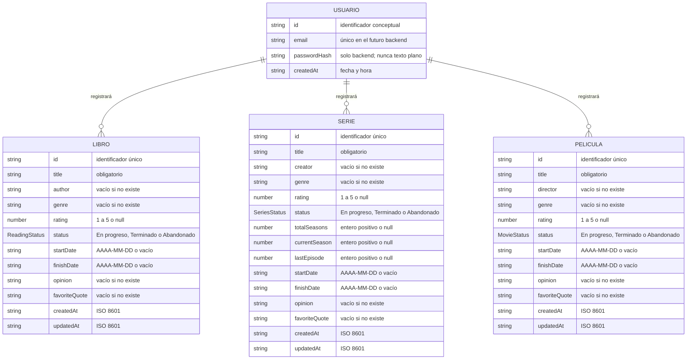

docs/diagrama-entidades.md
docs/uso-de-inteligencia-artificial.md# Diagrama de entidades de Bitácora Cultural

## 1. Objetivo

Este documento presenta de forma sencilla las entidades de Bitácora Cultural y su correspondencia con el modelo TypeScript actual. Distingue las tres entidades culturales ya implementadas en Angular de la entidad `Usuario` y sus relaciones, que pertenecen al diseño futuro del backend.

El diagrama es conceptual: no representa tablas MySQL ya creadas ni modifica los contratos de datos de la aplicación.

## 2. Diagrama de entidades

### Leyenda de implementación

- **Estado actual:** `LIBRO`, `SERIE` y `PELICULA` corresponden respectivamente a las interfaces `Book`, `SeriesEntry` y `MovieEntry`.
- **Pendiente de implementación:** `USUARIO` es una propuesta conceptual documentada para el futuro backend.
- **Relaciones futuras:** las tres líneas que parten de `USUARIO` expresan la propiedad prevista de los registros. Todavía no existen en Angular ni en una base de datos.

Los tipos `number` del diagrama con la anotación “o null” corresponden exactamente a propiedades `number | null` de TypeScript. Los textos y fechas opcionales desde el punto de vista funcional siguen siendo propiedades `string`; actualmente usan `''` cuando no hay información.

## 3. Descripción de las entidades

### Usuario — pendiente de implementación

Representará a la persona propietaria de su bitácora. Sus atributos proceden de la propuesta conceptual de `docs/modelo-de-datos.md`:

- `id`: identificador cuya estrategia definitiva se decidirá al diseñar el backend.
- `email`: correo que deberá normalizarse y ser único.
- `passwordHash`: hash generado y administrado exclusivamente por el backend; no deberá enviarse al frontend ni almacenar una contraseña en texto plano.
- `createdAt`: fecha y hora de creación.

No existe actualmente `user.model.ts`, un servicio de usuarios, una tabla de usuarios ni una sesión autenticada. El formulario de Login tampoco crea esta entidad.

### Libro — implementada actualmente

Corresponde a `Book` en `src/app/models/book.model.ts`. Registra identidad, título, autor, género, valoración, estado de lectura, fechas, opinión, frase favorita y marcas de creación y modificación.

`rating` admite `null`. Los textos y fechas funcionalmente opcionales se conservan como cadenas vacías cuando no se proporcionan. `status` utiliza `ReadingStatus` con los valores `En progreso`, `Terminado` y `Abandonado`.

### Serie — implementada actualmente

Corresponde a `SeriesEntry` en `src/app/models/series.model.ts`. Además de los datos culturales comunes, contiene `creator`, `totalSeasons`, `currentSeason` y `lastEpisode` para representar el progreso.

Los cuatro valores numéricos `rating`, `totalSeasons`, `currentSeason` y `lastEpisode` admiten `null`. `status` utiliza `SeriesStatus`.

### Película — implementada actualmente

Corresponde a `MovieEntry` en `src/app/models/movie.model.ts`. Registra director, género, valoración, estado, fechas, contenido personal y marcas de tiempo, además de su identificador y título.

`rating` admite `null`; los textos y fechas sin información usan cadenas vacías. `status` utiliza `MovieStatus`.

## 4. Cardinalidades conceptuales

| Relación | Cardinalidad | Interpretación | Estado |
|---|---|---|---|
| Usuario–Libro | `1` a `0..N` | Un usuario podrá registrar cero o muchos libros; cada libro pertenecerá a un usuario. | Futura, no implementada. |
| Usuario–Serie | `1` a `0..N` | Un usuario podrá registrar cero o muchas series; cada serie pertenecerá a un usuario. | Futura, no implementada. |
| Usuario–Película | `1` a `0..N` | Un usuario podrá registrar cero o muchas películas; cada película pertenecerá a un usuario. | Futura, no implementada. |

En Mermaid, `||` representa exactamente una instancia de Usuario y `o{` representa desde cero hasta muchas instancias de la entidad cultural.

No hay relaciones directas entre Libro, Serie y Película. Sus colecciones actuales son independientes.

## 5. Modelo actual y diseño futuro

| Aspecto | Angular actual | PHP/MySQL futuro |
|---|---|---|
| Entidades culturales | Interfaces `Book`, `SeriesEntry` y `MovieEntry`. | Tablas persistentes derivadas de un contrato de API todavía pendiente. |
| Usuario | No existe como interfaz o entidad funcional. | Entidad con correo único y hash de contraseña administrado por el backend. |
| Propiedad de registros | No hay `userId` ni propietario asociado. | Cada registro cultural deberá asociarse con el usuario autenticado. |
| Relaciones | Solo están documentadas conceptualmente. | Se definirán mediante claves foráneas al diseñar el esquema. |
| Persistencia | Señales Angular en memoria; los datos se pierden al recargar. | Persistencia en MySQL o MariaDB a través de una API PHP. |
| Identificadores | Cadenas generadas actualmente en los servicios. | Se deberá decidir entre conservar UUID o utilizar otra estrategia consistente. |
| Validación | TypeScript, formularios reactivos y servicios. | La API deberá repetir las validaciones y la base de datos aplicará sus restricciones. |

El diagrama no añade `userId` a las interfaces actuales. La forma de las claves foráneas, los nombres físicos de las tablas y el contrato HTTP se definirán cuando se implemente y pruebe el backend.

## 6. Correspondencia verificada con TypeScript

| Entidad del diagrama | Fuente actual | Correspondencia |
|---|---|---|
| `LIBRO` | `Book` | Todos los atributos de la interfaz aparecen en el diagrama. |
| `SERIE` | `SeriesEntry` | Todos los atributos de la interfaz, incluido el progreso, aparecen en el diagrama. |
| `PELICULA` | `MovieEntry` | Todos los atributos de la interfaz aparecen en el diagrama. |
| `USUARIO` | Propuesta de `docs/modelo-de-datos.md` | No corresponde a código implementado y está marcado como pendiente. |

`SeriesDraft` y `MovieDraft`, así como el `Omit` usado para crear libros, son tipos de entrada derivados de las entidades completas. No se representan como entidades porque no poseen identidad propia ni corresponden a registros independientes.

## 7. Uso de inteligencia artificial

La IA se utilizó para leer la documentación existente, contrastar cada atributo del diagrama con las interfaces TypeScript y redactar la explicación de las cardinalidades.

Se aceptaron como fuente de verdad los tres modelos actuales. `Usuario` se incluyó únicamente porque ya estaba documentado como propuesta conceptual. Se descartó añadir `userId`, claves foráneas, tablas o relaciones al código porque esas decisiones pertenecen a la futura implementación de PHP y MySQL.

## 8. Modificaciones de esta etapa

Se creó únicamente `docs/diagrama-entidades.md`. No se modificaron modelos, servicios, componentes, vistas, Login, rutas ni dependencias.
