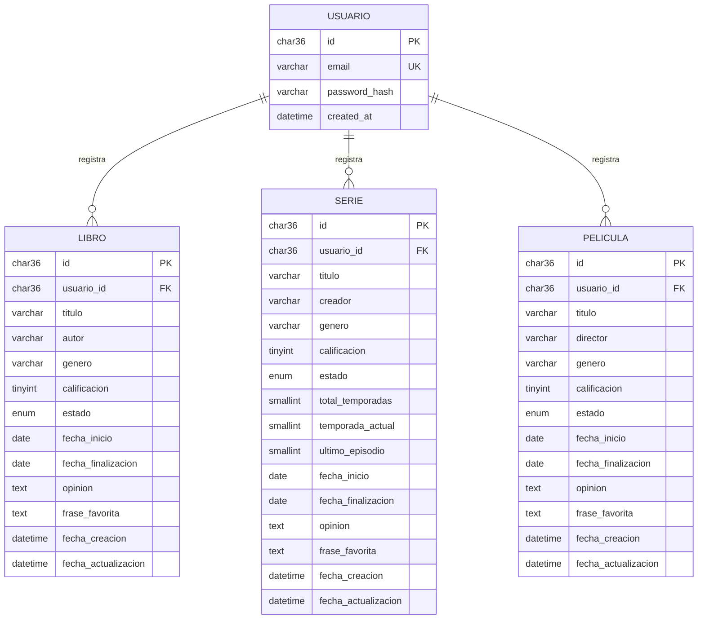

# Diagrama de entidades

## Objetivo

Representar las tablas implementadas en `database/schema.sql` y sus relaciones de propiedad.

## Entidades y cardinalidades

- **Usuario:** cuenta autenticada. El hash de contraseña solo se administra en PHP y MySQL.
- **Libro, Serie y Película:** registros culturales persistentes pertenecientes a una cuenta.
- Un usuario puede registrar cero o muchos elementos de cada tipo.
- Cada registro cultural pertenece exactamente a un usuario mediante `usuario_id`.
- Las claves foráneas usan eliminación en cascada según el esquema SQL.

## Correspondencia con Angular

Las interfaces TypeScript representan los datos culturales usados por la interfaz, con nombres en inglés. No incluyen `usuario_id` porque la API obtiene ese dato desde la sesión. La entidad Usuario tampoco se expone como modelo con `password_hash` en el frontend.

## Uso de IA

Codex contrastó el diagrama con `database/schema.sql`, los modelos TypeScript y los endpoints PHP. El resultado fue revisado para no añadir atributos o relaciones que no existan en la implementación.
