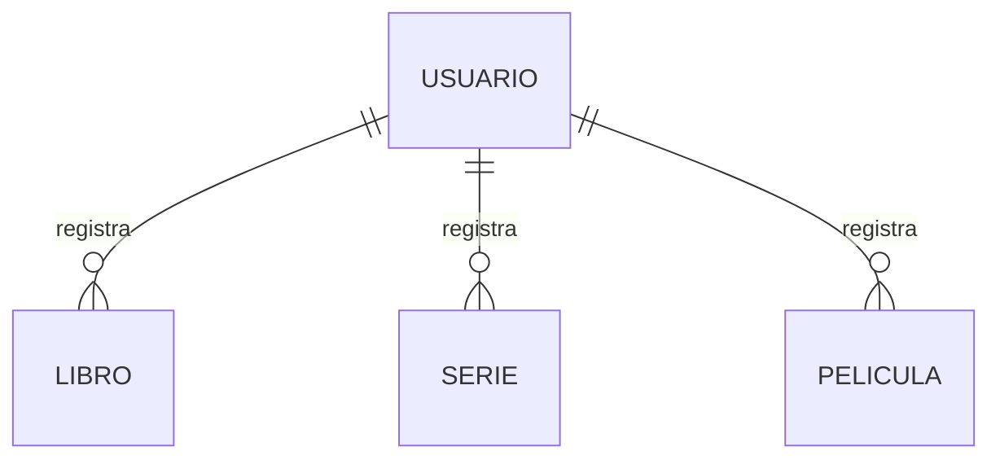

# Modelo de datos de Bitácora Cultural

## 1. Nombre y objetivo de la aplicación

**Bitácora Cultural** es una aplicación para registrar de forma privada los libros, series y películas que una persona consume. La versión actual utiliza Ionic y Angular y conserva los registros únicamente en memoria. La persistencia definitiva se implementará posteriormente mediante una API PHP y MySQL o MariaDB.

Este documento describe el código existente y separa ese estado del modelo conceptual previsto para el backend.

## 2. Descripción general

El código actual contiene tres entidades culturales independientes:

- `Book`: libro.
- `SeriesEntry`: serie.
- `MovieEntry`: película.

No existe todavía una entidad de usuario para autenticación. El formulario de Login contiene controles para correo y contraseña, pero no crea ni almacena usuarios.

Los servicios `BookService`, `SeriesService` y `MovieService` mantienen colecciones separadas mediante señales de Angular. Las colecciones comienzan vacías y se pierden al recargar la aplicación. No existe una base de datos, una API HTTP ni una relación con usuarios en esta etapa.

### Interpretación de los campos opcionales

Las propiedades de las interfaces TypeScript no utilizan el modificador `?`; todas deben existir en cada objeto. Sin embargo, varios campos son opcionales desde el punto de vista funcional:

- Los textos opcionales se representan mediante una cadena vacía (`''`).
- La calificación y los valores de progreso de series se representan mediante `null` cuando no existen.

En MySQL conviene representar la ausencia de estos valores mediante `NULL`, evitando usar cadenas vacías como sustituto de un valor ausente.

## 3. Entidades implementadas

### 3.1. Libro (`Book`)

Fuente: `src/app/models/book.model.ts`.

| Atributo | Tipo TypeScript | Requerido en el objeto | Regla funcional actual |
|---|---|---:|---|
| `id` | `string` | Sí | Identificador único generado por el servicio. |
| `title` | `string` | Sí | Obligatorio; no puede contener únicamente espacios y se guarda sin espacios externos. |
| `author` | `string` | Sí | Dato opcional; una cadena vacía representa ausencia. |
| `genre` | `string` | Sí | Dato opcional; una cadena vacía representa ausencia. |
| `rating` | `number \| null` | Sí | Opcional; cuando existe debe ser un entero entre 1 y 5. |
| `status` | `ReadingStatus` | Sí | `En progreso`, `Terminado` o `Abandonado`. |
| `startDate` | `string` | Sí | Fecha opcional en formato de control HTML (`AAAA-MM-DD`); vacío si no existe. |
| `finishDate` | `string` | Sí | Fecha opcional; no puede ser anterior a `startDate`. |
| `opinion` | `string` | Sí | Texto opcional; vacío si no existe. |
| `favoriteQuote` | `string` | Sí | Texto opcional; vacío si no existe. |
| `createdAt` | `string` | Sí | Fecha y hora ISO 8601 generada al crear el registro. |
| `updatedAt` | `string` | Sí | Fecha y hora ISO 8601 actualizada al editar. |

`ReadingStatus` es una unión de cadenas definida en el mismo archivo:

```text
'En progreso' | 'Terminado' | 'Abandonado'
```

El servicio utiliza `Omit<Book, 'id' | 'createdAt' | 'updatedAt'>` directamente para los datos de creación y actualización. No existe actualmente un alias `BookDraft`.

### 3.2. Serie (`SeriesEntry`)

Fuente: `src/app/models/series.model.ts`.

| Atributo | Tipo TypeScript | Requerido en el objeto | Regla funcional actual |
|---|---|---:|---|
| `id` | `string` | Sí | Identificador único generado por el servicio. |
| `title` | `string` | Sí | Obligatorio; no acepta solamente espacios y se guarda sin espacios externos. |
| `creator` | `string` | Sí | Dato opcional; vacío si no existe. |
| `genre` | `string` | Sí | Dato opcional; vacío si no existe. |
| `rating` | `number \| null` | Sí | Opcional; cuando existe debe ser un entero entre 1 y 5. |
| `status` | `SeriesStatus` | Sí | `En progreso`, `Terminado` o `Abandonado`. |
| `totalSeasons` | `number \| null` | Sí | Opcional; debe ser un entero mayor que cero. |
| `currentSeason` | `number \| null` | Sí | Opcional; debe ser un entero mayor que cero y no superar `totalSeasons` cuando ambos existen. |
| `lastEpisode` | `number \| null` | Sí | Opcional; debe ser un entero mayor que cero y requiere una temporada actual. |
| `startDate` | `string` | Sí | Fecha opcional en formato `AAAA-MM-DD`; vacío si no existe. |
| `finishDate` | `string` | Sí | Fecha opcional; no puede ser anterior a `startDate`. |
| `opinion` | `string` | Sí | Texto opcional; vacío si no existe. |
| `favoriteQuote` | `string` | Sí | Texto opcional; vacío si no existe. |
| `createdAt` | `string` | Sí | Fecha y hora ISO 8601 generada al crear. |
| `updatedAt` | `string` | Sí | Fecha y hora ISO 8601 actualizada al editar. |

`SeriesStatus` contiene los mismos tres valores de estado que Libros. `SeriesDraft` excluye `id`, `createdAt` y `updatedAt` para impedir que el formulario controle campos administrados por el servicio.

### 3.3. Película (`MovieEntry`)

Fuente: `src/app/models/movie.model.ts`.

| Atributo | Tipo TypeScript | Requerido en el objeto | Regla funcional actual |
|---|---|---:|---|
| `id` | `string` | Sí | Identificador único generado por el servicio. |
| `title` | `string` | Sí | Obligatorio; no acepta solamente espacios y se guarda sin espacios externos. Se permiten títulos repetidos. |
| `director` | `string` | Sí | Dato opcional; vacío si no existe. |
| `genre` | `string` | Sí | Dato opcional; vacío si no existe. |
| `rating` | `number \| null` | Sí | Opcional; cuando existe debe ser un entero entre 1 y 5. |
| `status` | `MovieStatus` | Sí | `En progreso`, `Terminado` o `Abandonado`. |
| `startDate` | `string` | Sí | Fecha opcional en formato `AAAA-MM-DD`; vacío si no existe. |
| `finishDate` | `string` | Sí | Fecha opcional; puede coincidir con `startDate`, pero no ser anterior. |
| `opinion` | `string` | Sí | Texto opcional; vacío si no existe. |
| `favoriteQuote` | `string` | Sí | Texto opcional; vacío si no existe. |
| `createdAt` | `string` | Sí | Fecha y hora ISO 8601 generada al crear. |
| `updatedAt` | `string` | Sí | Fecha y hora ISO 8601 actualizada al editar. |

`MovieStatus` contiene los mismos estados que las otras entidades. `MovieDraft` excluye los campos administrados por el servicio.

## 4. Entidad conceptual pendiente: Usuario

No existe actualmente `user.model.ts`, una interfaz equivalente ni un servicio de usuarios. `UserPhoto`, presente en el servicio de la plantilla fotográfica, representa una fotografía y no es una entidad de autenticación.

La siguiente tabla documenta la entidad prevista; **no representa código ni una tabla ya implementados**.

| Atributo conceptual | Tipo lógico | Posible tipo MySQL | Obligatorio | Consideraciones |
|---|---|---|---:|---|
| `id` | Identificador | `CHAR(36)` o `BIGINT UNSIGNED` | Sí | La estrategia final de identificadores debe decidirse antes de crear el esquema. |
| `email` | Texto | `VARCHAR(254)` | Sí | Debe normalizarse y tener una restricción única. |
| `passwordHash` | Hash de contraseña | `VARCHAR(255)` | Sí | Debe generarse en PHP con una función segura; nunca debe almacenarse ni transmitirse como contraseña en texto plano. |
| `createdAt` | Fecha y hora | `DATETIME` o `TIMESTAMP` | Sí | Debe almacenarse con una política horaria consistente, preferentemente UTC. |

El frontend no deberá recibir `passwordHash`. La respuesta de autenticación deberá contener solamente los datos de usuario necesarios para la interfaz y el mecanismo de sesión que se defina posteriormente.

## 5. Relaciones conceptuales

Las relaciones siguientes están previstas para MySQL y todavía no existen en las interfaces actuales:



| Relación futura | Cardinalidad | Estado actual |
|---|---|---|
| Usuario–Libro | Un usuario puede tener cero o muchos libros; cada libro pertenece a un usuario. | No implementada. `Book` no contiene `userId`. |
| Usuario–Serie | Un usuario puede tener cero o muchas series; cada serie pertenece a un usuario. | No implementada. `SeriesEntry` no contiene `userId`. |
| Usuario–Película | Un usuario puede tener cero o muchas películas; cada película pertenece a un usuario. | No implementada. `MovieEntry` no contiene `userId`. |

No hay relaciones directas entre Libro, Serie y Película. Cada servicio mantiene su propia colección; crear, editar o eliminar un registro de un tipo no modifica los otros tipos.

Cuando exista autenticación real, las tablas culturales deberán incorporar una clave foránea equivalente a `user_id`. No debe añadirse un identificador ficticio al frontend antes de definir la API y la sesión.

## 6. Reglas de negocio

1. Cada registro cultural posee un identificador único independiente de su título.
2. El título es obligatorio y no puede estar compuesto solamente por espacios.
3. Los estados permitidos son `En progreso`, `Terminado` y `Abandonado`.
4. La calificación es opcional. Cuando existe, debe ser un entero entre 1 y 5; `null` significa “Sin calificar”.
5. La fecha de finalización no puede ser anterior a la fecha de inicio. Ambas pueden coincidir.
6. Elegir el estado `Terminado` no asigna automáticamente una fecha final ni una calificación.
7. Los campos de texto opcionales conservan su contenido; opinión y frase favorita admiten saltos de línea.
8. En Series, los valores de temporadas y episodios son opcionales y deben ser enteros positivos cuando existen.
9. En Series, la temporada actual no puede superar el total indicado.
10. En Series, no puede registrarse un último episodio sin una temporada actual.
11. `createdAt` se establece al crear el registro y `updatedAt` cambia únicamente al editarlo.
12. Las colecciones actuales comienzan vacías y no contienen registros asociados a usuarios ficticios.
13. La eliminación se realiza por identificador y afecta solamente al registro seleccionado dentro de su colección.

Estas reglas se aplican actualmente en los formularios y servicios Angular. El backend deberá volver a validarlas; no debe confiar únicamente en la validación del frontend.

## 7. Tipos y elementos compartidos

No existe un modelo base para los campos culturales comunes. Los tres modelos repiten `title`, `genre`, `rating`, `status`, fechas, opinión, frase favorita y marcas de tiempo.

Los tipos `ReadingStatus`, `SeriesStatus` y `MovieStatus` contienen los mismos valores, pero están declarados por separado. Esta duplicación funciona en la versión actual. Una futura etapa puede evaluar un tipo compartido sin modificar el contrato de datos, pero dicha refactorización no forma parte de este entregable.

`SeriesDraft` y `MovieDraft` son tipos auxiliares explícitos. Libros utiliza el mismo patrón mediante `Omit` directamente en las firmas del servicio.

## 8. Modelo Angular actual frente al modelo MySQL previsto

| Aspecto | Angular actual | MySQL y API previstos |
|---|---|---|
| Persistencia | Señales en memoria; se pierde al recargar. | Tablas persistentes consultadas mediante la API PHP. |
| Usuario | No existe modelo de autenticación. | Tabla de usuarios con correo único y hash seguro. |
| Propiedad de registros | No existe `userId`. | Cada tabla cultural tendrá una clave foránea hacia Usuario. |
| Identificadores | `string`, normalmente generado con `crypto.randomUUID()`. | Puede conservarse como UUID (`CHAR(36)`) o migrarse a enteros; debe elegirse una estrategia única. |
| Campos opcionales de texto | Cadena vacía. | Preferentemente columnas anulables con `NULL` cuando no existe el dato. |
| Calificación | `number \| null`. | `TINYINT UNSIGNED NULL` con validación entre 1 y 5. |
| Estado | Unión de cadenas TypeScript. | Columna textual o enumerada con restricción a los tres valores permitidos. |
| Fechas de consumo | Cadenas `AAAA-MM-DD`. | Columnas `DATE NULL`. |
| Marcas de tiempo | Cadenas ISO 8601. | `DATETIME` o `TIMESTAMP`, con conversión consistente a ISO en la API. |
| Integridad | Validadores del formulario y operaciones del servicio. | Restricciones de base de datos y validación obligatoria en PHP. |
| Contrato de escritura | Objetos `Omit` o `Draft`. | DTO y cuerpos JSON que se definirán junto con los endpoints. |
| Seguridad | Login informativo, sin sesión real. | Hash de contraseña, autenticación, autorización y aislamiento por usuario. |

### Correspondencia recomendada para los registros culturales

Esta correspondencia es una guía para la etapa de diseño físico, no un esquema ya creado:

- Identificadores: `CHAR(36)` si se conservan los UUID actuales.
- Títulos, autor, creador, director y género: `VARCHAR` con longitudes definidas durante el diseño físico.
- Opinión y frase favorita: `TEXT NULL`.
- Calificación y progreso: tipos enteros pequeños con restricciones y posibilidad de `NULL`.
- Fechas de inicio y finalización: `DATE NULL`.
- `created_at` y `updated_at`: fecha y hora administrada por el backend.
- `user_id`: clave foránea obligatoria cuando se implemente la propiedad de los registros.

## 9. Aspectos pendientes para PHP y MySQL

1. Definir el esquema físico, nombres de tablas y convenciones de columnas.
2. Elegir definitivamente UUID o identificadores numéricos.
3. Crear la tabla de usuarios y las tres tablas de registros culturales.
4. Incorporar claves foráneas y reglas de eliminación o conservación de registros.
5. Normalizar el correo y aplicar una restricción única.
6. Implementar hash y verificación segura de contraseñas exclusivamente en el backend.
7. Diseñar autenticación y autorización para impedir el acceso a registros de otros usuarios.
8. Validar en PHP títulos, estados, calificaciones, fechas y progreso de series.
9. Definir DTO, formatos JSON, códigos HTTP y manejo de errores.
10. Implementar operaciones GET, POST, PUT o PATCH y DELETE.
11. Probar cada endpoint con Postman antes de conectarlo con Angular.
12. Sustituir gradualmente los servicios en memoria por servicios HTTP.
13. Definir conversión entre `NULL` de MySQL y los valores vacíos usados actualmente por los formularios.
14. Establecer una política horaria para `createdAt` y `updatedAt`.

## 10. Uso de inteligencia artificial en este entregable

La IA se utilizó para inspeccionar los modelos, servicios y validadores existentes; comparar sus tipos y reglas; identificar que Usuario y las relaciones todavía no están implementados; y redactar esta documentación.

Se aceptaron como fuente de verdad las interfaces TypeScript y el comportamiento observable de los servicios y formularios. Se documentaron como propuestas únicamente Usuario, las claves foráneas y las correspondencias futuras con MySQL. No se añadieron atributos a los modelos existentes ni se modificaron vistas, servicios, autenticación o configuración del proyecto.
